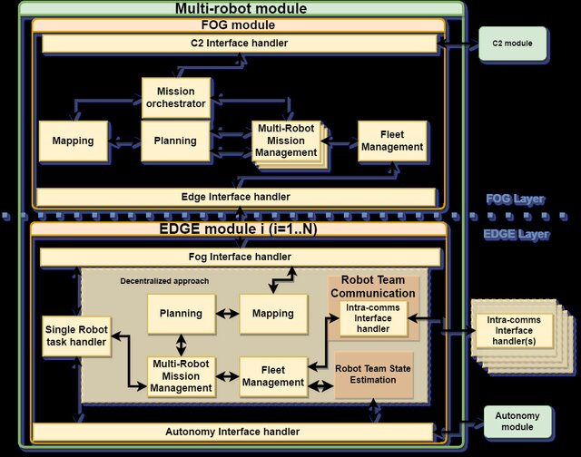

# Multi-Robot ROS2 Framework for Ground Vehicles


## Overview

This repository serves as a Multi-robot ROS2 (C++) framework designed for ground vehicles. The primary purpose is to enable swarming capabilities as part of the European Defence Industrial Development Programme (EDIDP) Integrated Modular Unmanned Ground System (iMUGS) project. The framework is developed to showcase a centralized multi-robot coordination approach using real autonomous Unmanned Ground Vehicle (UGV) platforms.

Please have a look at our [conference paper](https://www.researchgate.net/publication/367284307_iMUGS_-_A_ground_multi-robot_architecture_for_military_Manned-Unmanned_Teaming) to understand the underlying architecture.

For more information about the iMUGS project: [RMA page](https://mecatron.rma.ac.be/index.php/projects/imugs/)


**View Demonstration Videos:**
- [iMUGS demonstration 4](https://www.youtube.com/watch?v=juY6JTBGVV8)
- [iMUGS demonstration 5](https://www.youtube.com/watch?v=cNlFh12Eevs)
- [iMUGS demonstration 6](https://www.youtube.com/watch?v=gCkIzY5QPnE)
- [iMUGS demonstration 7](https://www.youtube.com/watch?v=jnSOvB6XV8M)


## Architecture

Within the iMUGS architecture, the multi-robot module is composed of a central fog module and distributed edge modules. 
The fog module is interfaced with the command and control (C2) module and orchestrates the mission planning, execution and the fleet management. The edge module is running on the mobile robots and takes care of supervising the execution of the computed trajectories. The module that takes care of reaching one waypoint after the other autonomously is the Autonomy module. 




### Included Features

- **Swarm Manager:** The swarm Manager is the fog module but without the mapping and planning submodules. The Swarm Manager module communicates with C2 (command & Control) and with the edge module of every agent.
- **Swarm Edge Client:** The Swarm Edge Client is the edge module, which communicates with the Swarm Manager and the Autonomy module

### Not (yet) included
- **Command and Control (C2):** The C2 module is collocated with but not part of the fog module. This repository only includes a terminal C2 with basic command and control features for development.  
- **Swarm Planner:** The swarm planner is part of the fog module and takes care of the mapping and trajectory planning based on the mission definition as requested by the C2 module.
- **Autonomy:** The Autonomy module takes care of the motion planning to reach the successive waypoints as requested by the edge module. 

This repository has basic simulation nodes for the latter modules to allow easy integration by substitution.

<!-- # Usage

## Getting Started

1. **Prerequisites:** Ensure you have ROS2 installed on your system.
2. **Clone the Repository:**
    ```bash
    git clone https://github.com/your-username/your-repository.git
    cd your-repository
    ```
3. **Build the Framework:**
    ```bash
    colcon build
    ``` -->

# Usage

## Swarm Manager

As stated before, the Swarm Manager module communicates with C2 (command & Control), with the Swarm Planner (not included in this repository), which are all collocated on the Fog. The swarm Manager Module also communicates with the individual agents (Edge devices) remotely. The latter edge devices run the edge module (namely the Swarm Edge Client).

The whole communication network is using FASTRTPS dynamic, using DDS as a middleware.

The ROS2 nodes spinned by the **executor.cpp** are:
* **C2_interface_node**: ROS2 interfaces with C2 are instantiated here
* **swarm_orchestrator_node**: The main processes of the swarm manager are executed here (initializing a mission, adding it to the database, ...)
* **edge_manager_node**: The interface with the edge devices and the main processes related to sending individual agent tasks and changing task states
* **mission_manager** (multiple instances): One node for each mission is created. Here, the state machine is running for a specific mission and all mission-related processes are manger here (planning a mission, start, pause, stop, delete, ...)
* **swarm_planner** ( **! not spinned by executor**): This was dotOcean's task, so only the docker image is available. However, our own version is under development in another git repo. 

MongoDB is used for storing multiple json objects. The different databases are:
1. **MissionDB**:
* MissionConfig (=json files gathering all operator-defined mission parameters)
* Planning
2. **FeedbackDB**:
* MissionFeedback (= json files sent to C2 giving feedback about a specific mission)
3. **VehicleDB**:
* Vehicles (= all kind of vehicle information like fuel level, size, constraints, connexion status, ...)


### Using Docker

**Prerequisites:**
* Docker and docker-compose should be installed
* The latest docker image of MongoDB from DockerHub should be pulled
* (optional) [MongoDB Compass](https://www.mongodb.com/try/download/compass) installed for visualization of the databases
* The docker image of the Swarm Manager should be either:
- pulled from the [gitlab container registry](https://gitlab.cylab.be/rma-ras/imugs/swarm_manager/container_registry) 
- built locally through the DockerFile with the whole workspace
- loaded from a [compressed .tar](https://docs.docker.com/engine/reference/commandline/save/) file of the image
* The [`docker-compose.yaml`](docker-compose.yaml) and [`config.yaml`](config.yaml) files should be available in the current working directory


To run docker images with the Docker Plugin in VS Code, right-click on any `docker-compose.yaml` and select 'Compose Up' (or in terminal running `docker-compose up` ).
To view the logs: using Docker Plugin, right-click on swarm_manager container which is running and select "View Logs". Or using terminal: find its contained ID with "docker ps" and run "docker logs --follow <container_id>"

1. Go to docker-compose-dir/swarm_manager
2. Run the `mongodb-docker-compose.yaml` to run de database independently
3. Run the `docker-compose.yaml` file to start the swarm manager (**! depends on mongodb !**)
4. To have the C2 control, in another terminal, run "docker-compose run --rm c2_sim ". This allows to run the terminal C2 simulator interactively. 
5. Go to docker-compose-dir/swarm_planner to run the `swarm-planner-docker-compose.yaml`. Remember that this swarm planner is no included in this repo. 


### Run locally (not recommended)
**Prerequisites:**

* Dependencies installed:
```
cd .config/
. install-dependencies.sh
. install-custom-message-packages

```
* (optional) [MongoDB Compass](https://www.mongodb.com/try/download/compass) installed for visualization of the databases


1. Source ROS & install in all Terminals:
```
. /opt/ros/galactic/setup.bash && . install/local_setup.bash
```


2. (optional) Setup FastRTPS:

in all terminals: 
```
export RMW_IMPLEMENTATION="rmw_fastrtps_dynamic_cpp"
```


3. Setup mongoDB:
Choose MongoDB hostname and port:
```
export MONGODB_CONNSTRING=mongodb://localhost:27017
```

Start MongoDB ('start' can be replaced by 'stop' or 'restart'):
```
sudo systemctl start mongod
```

Verify that MongoDB has started successfully:
```
sudo systemctl status mongod
```


4. Terminal 1 - run the whole Swarm Manager module
```
ros2 run swarm_manager swarm_manager_executable
```

**Testing with C2 and swarm planner simulators:**

5. Terminal 3 - simulating the swarm planner
```
ros2 run swarm_manager test_swarm_planner_sim
```

6. Terminal 4 - simulating C2
```
ros2 run swarm_manager test_c2_sim
```


## Swarm Edge Client

This project uses ROS2 C++ node(s) to act as the edge module of swarming within the iMUGS project.
The Swarm Edge Client module communicates with Autonomy (also on edge, so locally) and with the Swarm Manager (on the Fog, so remotely). There is one instance of this module for each UGV, running independently of each other. 

The whole communication network is using FASTRTPS dynamic, with eProsima integration service.

The only ROS2 node of this specific module is:
* **agent_ uuid**: swarm edge client node which manages tasks and sends individual waypoints to autonomy.


### Run with Docker-Compose

**Prerequisites:**

* Docker and docker-compose should be installed
* The docker image of the Swarm Edge Client should be either:
- pulled from the [gitlab container registry](https://gitlab.cylab.be/rma-ras/imugs/swarm_edge_client/container_registry) 
- built locally through the DockerFile with the whole workspace
- loaded from a [compressed .tar](https://docs.docker.com/engine/reference/commandline/save/) file of the image
* The [`docker-compose.yaml`](docker-compose-dir/single-agent-with-autonomy-sim/docker-compose.single-agent-with-autonomy-sim.yaml) and [`config.yaml`](docker-compose-dir/single-agent-with-autonomy-sim/config.yaml) and [`launch_swarm_edge.sh`](docker-compose-dir/single-agent-with-autonomy-sim/launch_swarm_edge.sh) files should be available in the same working directory


## Using Docker

1. Go to docker-compose-dir and navigate to desired configuration (multiple agents, single agent with or without autonomy, ...)
2. Comment/uncomment specific services in the `docker-compose.yaml` file based on desired running modules. The minimum service is the swarm_edge_client. Change the AGENT_ID environment variable here (it should be a uuid)
3. Adapt the `config.yaml` file based on desired parameters. For edge-only testing, set the corresponding parameter to True (the node will then use the given waypoints as a task)
2. With the Docker Plugin in VS Code, right-click on the desired `docker-compose.yaml` and select 'Compose Up' (or in terminal running `docker-compose up` )
3. To view the swarm edge client logs: using Docker Plugin, right-click on swarm_manager container which is running and select "View Logs". Or using terminal: find its contained ID with "docker ps" and run "docker logs --follow <container_id>"
**Comment:** The autonomy simulator node can't differentiate between multiple swarm_edge_clients messages (and vice-versa). 

| Folder                           | Comments                                                                            |
|----------------------------------|-------------------------------------------------------------------------------------|
| multiple-agents-sim              | create multiple instances of swarm-edge-client                                      |
| multiple-agent-sim-with-autonomy | create multiple instances of swarm-edge-client + autonomy simulation for all agents |
| single-agent                     | create one instance of swarm-edge-client (deployed version)                         |
| single-agent-with-autonomy-sim   | create one instance of swarm-edge-client + autonomy simulation                      |
-------------------------------------------------------------------------------------------------------------------------|


## Run locally (not recommended)

**Prerequisites:**


* Dependencies installed:
```
cd .config/
. install-dependencies.sh
. install-custom-message-packages

```
**Usage:**

1. Terminal 1 - run the whole Swarm Edge Client module
```
. ros2ws/launch_swarm_edge.sh
```

2. (For Testing) Terminal 2 - simulating the autonomy (if no autonomy module running on the robot)
```
. ros2ws/launch_autonomy_sim.sh
```


## License

This project is licensed under the [MIT License](LICENSE).
